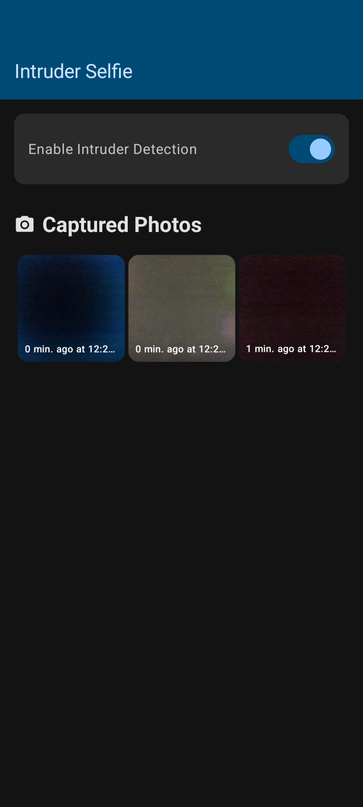

# IntruderSelfie

IntruderSelfie silently snaps a front-camera photo **every time the screen is unlocked** with a precise timestamp.

## Key points
* Runs as a **lightweight foreground service** after device boot – no need to keep the app open.
* Works **offline** – no internet, ads, or third-party libraries.
* Uses only the minimum Android permissions: Camera for photos, Foreground-Service to stay alive, Boot-Completed to start after reboot, and Storage to save images locally.
* Compatible with Android 8 → 14 (API 26-35).

## How it works
1. Install, grant Camera & Notification permissions once.
2. A persistent notification “Watching for unlocks…” appears; you can minimise the app.
3. Each unlock triggers a silent photo saved to the app.
4. Photos remain on-device only; no cloud, no data sharing.

## Privacy & Security
- No analytics, trackers, or background network traffic.
- Source code is publicly available for review.

## License
This project is licensed under the MIT License - see the [LICENSE](LICENSE) file for details.
